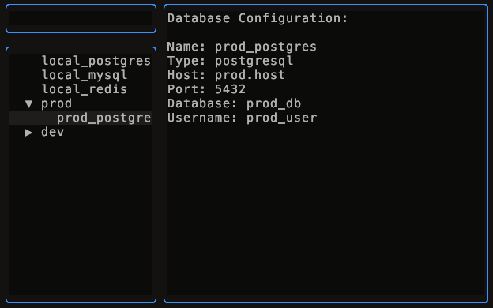
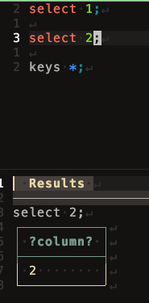
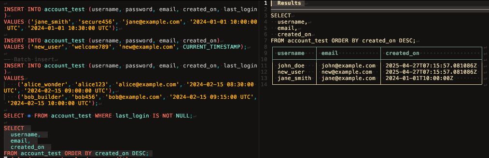
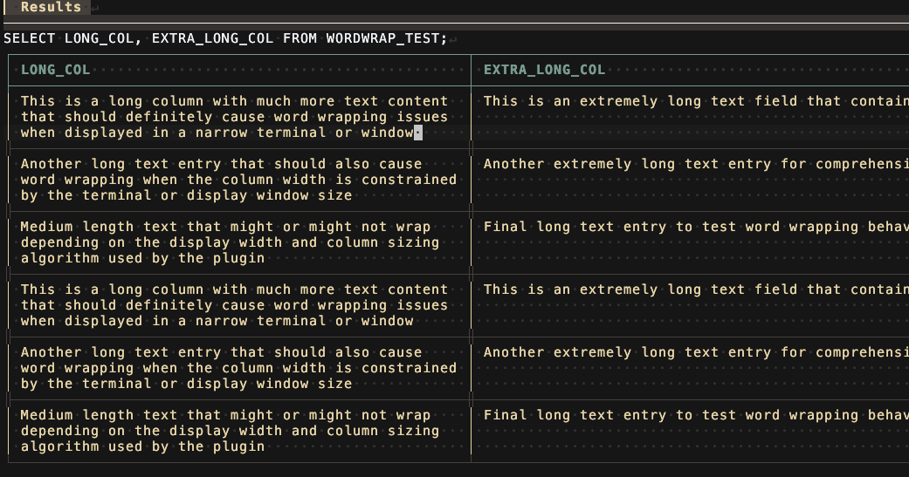

# sqlflick.nvim

A lightweight Neovim plugin for executing SQL queries with minimal setup. Designed for quick and efficient database interactions directly from your workspace.

> **Note**: This plugin is actively maintained and developed based on real-world needs. Breaking changes may occur as features are continuously improved.

## Why sqlflick.nvim?

- No need to leave your beloved neovim 🥰 to query!
- No external dependency (DB client)
- Flick your finger to run query, immediately
  - `<leader>ss` -> select db (for once, in session)
  - `<leader>sq` -> run query

## Features

- **Database Connection Management**

  - Pre-configure multiple database connections
  - Quick switching between different databases
  - In below screen shot, empty box is place for search to filter configuration.

    

- **Query Execution**

  - Execute queries directly from your SQL buffer
  - Support for both single-line and multi-line queries

    

    

- **View Result with handy features**

  - Column Wrap
    - When you have large/long data that hard to catch with your eyes at once,  
       you can use `column wrap` function to break down as muliple lines.  
       Press `W` in column to toggle column wrap



- Navigating Columns
  - For real world database, it is common table have many columns which contain many charactors.  
     It will be hard to move cursor to next column, by moving word by word.
    Use Navigating feature to fly on the columns

## Installation

Using [Lazy.nvim](https://github.com/folke/lazy.nvim):

> [!NOTE]
> When update the plugin and if there is some problem, recommend to run `SQLFlickInstall`

```lua
{,
    "nolleh/sqlflick.nvim",
    config = function()
        require("sqlflick").setup({
            databases = {
                {
                    name = "local_mysql",
                    type = "mysql",
                    host = "localhost",
                    port = 3306,
                    database = "mydb",
                    username = "user",
                    password = "pass"
                },
            },
        })
    end,
    -- recommended load plugin option
    cmd = { "SQLFlickSelectDB", "SQLFlickExecute", "SQLFlickExecuteBuf", "SQLFlickInstall", "SQLFlickRestart" },
    -- If you want to load/enable the plugin only for specific file_type, use this
    ft = { "sql", "pgsql" },
}
```

## Configuration

[full-configuration](./lua/sqlflick/config.lua)  
[example-configuration](./test/test.lua)

```lua
{
    -- Database connections
    databases = {
        -- {
        --     name = "local_mysql",
        --     type = "mysql",
        --     host = "localhost",
        --     port = 3306,
        --     database = "mydb",
        --     username = "user",
        --     password = "pass"
        -- },
    },

    -- DBSelector window settings
    selector = {
        width = 60,
        height = 15,
        border = "rounded",
    },

    -- Display window settings
    display = {
        position = "bottom", -- "bottom" or "right"
        size = {
            height = 0.2, -- 20% of total height when position is "bottom"
            width = 0.3,  -- 30% of total width when position is "right"
        },
        size_absolute = {
            height = nil, -- Absolute height in lines
            width = nil,  -- Absolute width in columns
        },
    },

    -- Backend settings
    backend = {
        host = "localhost",
        port = 9081 -- use some unknown port that not conflicting with your environment
    },
}
```

## Key Mappings

The following mappings are available for SQL-related file types (e.g., `.sql`, `.pgsql`, `.mysql`):

| Command              | Mode | Key Binding  | Description                |
| -------------------- | ---- | ------------ | -------------------------- |
| `SQLFlickSelectDB`   | n    | `<leader>ss` | Select database connection |
| `SQLFlickExecuteBuf` | n    | `<leader>sq` | Execute current line query |
| `SQLFlickExecute`    | v    | `<leader>sq` | Execute selected query     |

The following mappings are available in specific pages. (not user command)

| name               | mode | Key binding | runnable view | description                                           |
| ------------------ | ---- | ----------- | ------------- | ----------------------------------------------------- |
| Toggle column wrap | n    | `W`         | result view   | Place your cursor to long data column, to toggle wrap |
| Navigate column    | n    | `c{i}`      | result view   | Navigate cursor to specified column number            |
| Previous column    | n    | `[c`        | result view   | Navigate cursor to previous column                    |
| Next column        | n    | `]c`        | result view   | Navigate cursor to next column                        |

## Supported Database

| Database   | Support | Planned | Remark |
| ---------- | ------- | ------- | ------ |
| MySql      | ✅      |         |        |
| PostgreSQL | ✅      |         |        |
| sqlite     | ✅      |         |        |
| Redis      | ✅      |         |        |
| Oracle DB  | ✅      |         |        |
| Mongo DB   |         | ✅      |        |
| Dynamo DB  |         | ✅      |        |

## Trouble Shoot

### Migration

> [!NOTE]
> When update the plugin and if there is some problem, recommend to run `SQLFlickInstall`

If this is not sufficient to your situation and it occured after update the plugin, plz refer [WIKI/Migration-Guide](https://github.com/nolleh/sqlflick.nvim/wiki/Migration-Guide)

### Debug Command

You can use debug command with `:SQLFlickDebug` after plugin is loaded, which will print similar information with following.

```bash
SQLFlick Debug Info:
Enabled: true
Backend version:  0.3.1
Backend install path: /Users/nolleh/.local/share/nvim/sqlflick/bin/sqlflick-backend
Backend port: 9091
Number of databases: 4
- local_postgres (postgresql)
- local_mysql (mysql)
- local_redis (redis)
- local_sqlite (sqlite)

```

## Contributing

We welcome and appreciate contributions from the community! Here's how you can help:

- **Bug Reports**: Found a bug? Please open an issue with detailed steps to reproduce.
- **Feature Requests**: Have an idea for a new feature? Open an issue to discuss it.
- **Code Contributions**: Submit a pull request with a clear description of your changes
- **Documentation**: Help improve our documentation by fixing typos, adding examples, or clarifying instructions.

Before contributing, please read our [Contributing Guidelines](CONTRIBUTING.md) (if available) and ensure your code follows our coding standards.

## License

This project is licensed under the MIT License - see the [LICENSE](LICENSE) file for details.

## Feedback

Your feedback is valuable to us! Here are the ways you can contribute to the project's development:

Visit our [GitHub repository](https://github.com/nolleh/sqlflick.nvim) to:

- Open an issue
- Submit a pull request
- Start a discussion
- Star the project to show your support
